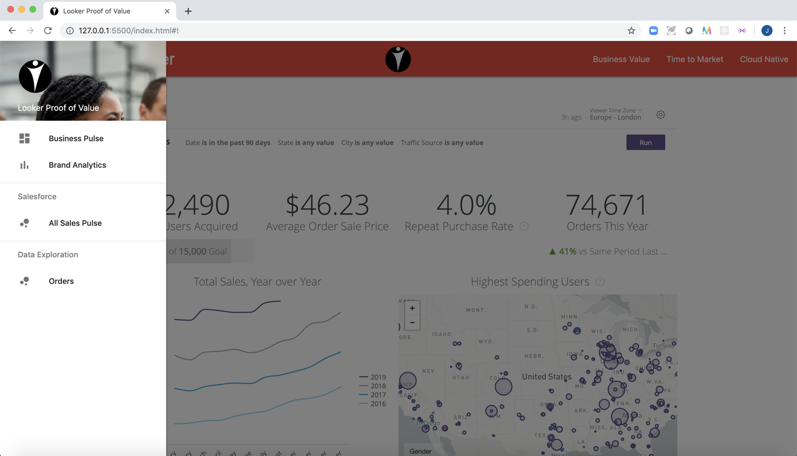

# Prep a PBL demo in minutes

With a live http server and a single file to update, you can get a simple-but-fast PBL demo running in minutes. Configure a selection of content (dashboards, looks, explores), change the logo, set the colors, tweak the HTML pages. If you leave the HTML as-is, all via a single config file.

(using VS Code with the Live Server extension makes it especially quick'n'easy)

# Configuration

Changes are required in the following places:

1. On the Looker Instance
2. Update images in img/
3. Update the config.js file in root directory
4. (Optional) Update the html content

NOTE: you can have multiple themes available for demonstration, by replicating the full directory structure. Examples of this are found in the `themes` and `confidential_example` directories.

_The `.gitignore` directory includes a `confidential` directory for scenarios where it is important to have multiple, commercially confidential brand themes that must not be uploaded to the GitHub repo._

### On the Looker instance:
_admin/embed_ - Set Embedded Domain Whitelist

_admin/themes_ - Set Theme (I recommend getting rid of the grey background by quickly copying Looker theme to LookerWhite, and setting the background to #ffffff )

### Images
For simplest configuration, replace the images provided:

- favicon.ico (_Standard browser tab favicon_)
- image.png (_Used as a background image for sidebar_)
- logo.png (_Used for the center of the nav bar_)

### Config.js
All icons refer to the Material Design icon set. Refer to https://materializecss.com/icons.html.

1. Update baseURL and embedDomain
2. Update content: {} with your chosen dashboards, looks and explores 
   - 'Main Dashboard' is required, and will be the dashboard shown by default
3. Update sidebarItems: {} 
   - Use type: 'li' for a link to content
     - Use content: '' to refer to one of the keys in your content object (also used for the display text)
   - Use type: 'subheader' to create a subheader
     - Use text: '' for the text you want displayed in the sidebar
4. Review the full config.js file, other things such as the page title can also be set

### HTML

You can add more or remove pages using the `navbarMenu` object in `config.js`, but by default this template has four links to HTML content. These can be used to provide explanatory text or images. The default files are intended to support:

1. A 'Themes' page that enables you to switch between different themes
2. A 'Business Value' page to capture the end user business case for Looker
3. A 'Time to Market' page to explain how Looker enables organisation to leverage their data analysts
4. A 'Cloud Native' page to explain Looker's architecture and role within a larger digital or cloud strategy
